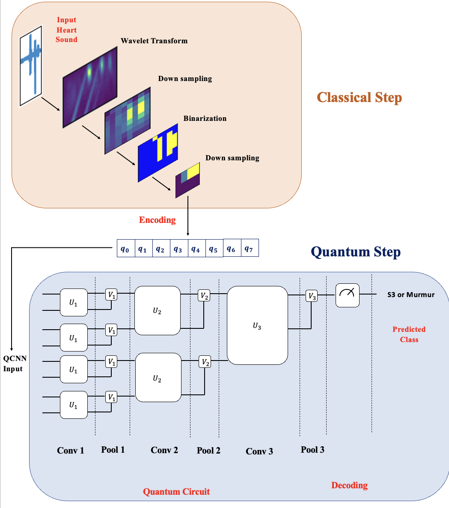

# QuPCG: Quantum Convolutional Neural Network for Detecting Abnormal Patterns in PCG Signals

---

**For the full paper and technical details, please refer to:**

- Torabi, Y., Shirani, S., & Reilly, J. P. (2025). QuPCG: Quantum Convolutional Neural Network for Detecting Abnormal Patterns in PCG Signals. ArXiv. https://arxiv.org/abs/2511.02140

## Abstract

Early identification of abnormal physiological patterns is essential for the timely detection of cardiac disease. This work introduces a hybrid quantum–classical convolutional neural network (QCNN) designed to classify S3 and murmur abnormalities in heart sound signals. The approach transforms one-dimensional phonocardiogram (PCG) signals into compact two-dimensional images through wavelet feature extraction and adaptive compression. The cardiac sound patterns are progressively compressed into an 8-value representation so that only 8 qubits are needed for the quantum stage. The QCNN then extracts hierarchical features through successive quantum convolution and pooling layers. Preliminary results on the HLS-CMDS dataset demonstrate **93.33% classification accuracy on the test set**, showing the potential of compact quantum–classical models for biomedical signal processing.

---

## Method

The proposed method consists of a classical preprocessing stage followed by a quantum processing stage. The classical stage transforms PCG signals into compact quantum-ready representations using:

- Continuous Wavelet Transform (CWT)
- Complex Morlet wavelet
- Downsampling
- Binarization
- Feature compression

The resulting representation contains **8 values**, which are encoded into **8 qubits**. The quantum stage consists of three successive quantum convolution and pooling stages, followed by measurement for classification.

---

## Dataset

The experiments use the **HLS-CMDS** heart and lung sound dataset.

- 535 recordings
- CAE Juno clinical manikin
- 3M Littmann CORE Digital Stethoscope
- Sampling rate: 22,050 Hz
- Recording duration: 15 seconds
- Normal and abnormal cardiac sounds
- Classification task: S3 vs. murmur

The dataset is publicly available:

- https://github.com/Torabiy/HLS-CMDS

---

## Implementation

The quantum circuit was implemented using:

- Qiskit 0.45
- AerSimulator
- 8 qubits
- COBYLA optimizer
- Learning rate: 0.01
- Batch size: 16
- 200 training epochs
- 1000 epochs for the enhanced W-QuPCG⁺ model
- NVIDIA GeForce RTX 4090 GPU with 24 GB memory

`demo.py` provides a preliminary demonstration of the QuPCG framework for processing PCG features with an 8-qubit quantum convolutional neural network (QCNN) for abnormal heart-sound pattern detection.

---

## Citation

If you use this code or research in your work, please cite:

- Torabi, Y., Shirani, S., & Reilly, J. P. (2025). QuPCG: Quantum Convolutional Neural Network for Detecting Abnormal Patterns in PCG Signals. ArXiv. https://arxiv.org/abs/2511.02140

---

## License

© 2026 by Yasaman Torabi. All rights reserved.
